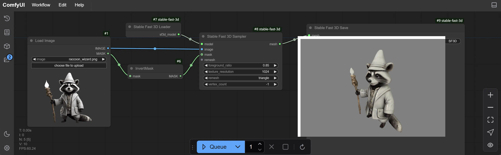
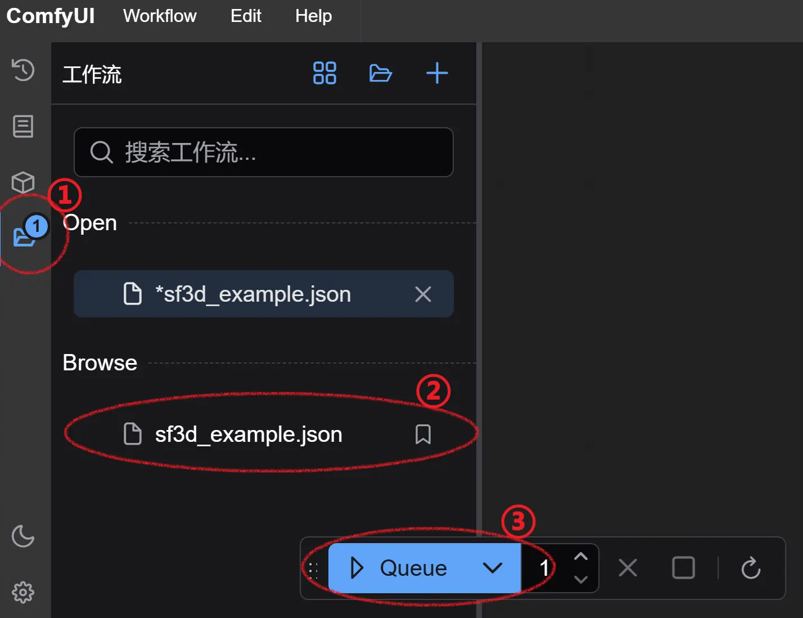

# StableFast3D Windows Portable

一个专门用来在 Windows 下运行
https://github.com/Stability-AI/stable-fast-3d[Stable Fast 3D]
官方 ComfyUI 工作流的整合包。

## 使用步骤

1. 需要 NVIDIA GPU，至少 8GB 显存。

2. 安装 Visual Studio Build Tools 2022
（
https://visualstudio.microsoft.com/downloads/?q=build+tools[下载页面]
|
https://aka.ms/vs/17/release/vs_BuildTools.exe[安装程序]
），
选择安装“桌面C++开发”，仅需要这两个可选项：

** MSVC 生成工具（最新即可）
** 用于 Windows 的 C++ CMake 工具
** 3D 工作流需要 JIT 编译 PyTorch C＋＋ 扩展，所以需要编译工具。如果你已经安装了 Visual Studio C++ 工作负载，不必重复安装。

3. 安装
https://developer.nvidia.com/cuda-12-4-1-download-archive?target_os=Windows&target_arch=x86_64&target_version=11&target_type=exe_network[CUDA Toolkit]，
版本不新于 12.4.1，再高会有兼容性问题。
安装时只需要勾选
https://github.com/YanWenKun/ComfyUI-Windows-Portable/raw/refs/heads/main/docs/cuda-toolkit-install-selection.webp[Libraries 以及 Compilers]
。

4. Hugging Face 相关：

** 注册／登录
https://huggingface.co/login[Hugging Face]。

** 打开
https://huggingface.co/stabilityai/stable-fast-3d[Stable Fast 3D 仓库页面]，
填写表格，并同意 Stability AI 的协议。

** 打开
https://huggingface.co/settings/tokens/new?tokenType=read[Access Tokens 页面],
创建一个只读 token。

5. 在
https://github.com/YanWenKun/StableFast3D-WinPortable/releases[StableFast3D-WinPortable/releases]
页面，
下载 `SF3D.7z`，解压到一个方便的地方。

6. 编辑 `run_cn.bat`，查找 `hf_your_token` 并替换为步骤4中创建的只读 token。

7. （可选）如果你已有下列模型文件保存在 `%USERPROFILE%\.cache\huggingface\hub`，
可将它们复制／移动到 `SF3D\HuggingFaceHub` 文件夹。

** `CLIP-ViT-B-32-laion2B-s34B-b79K`
** `dinov2-large`
** `stable-fast-3d`

8. 运行 `run_cn.bat`。
** 启动完毕后，会自动打开浏览器并访问 http://localhost:8188/

9. 在左侧边栏中，找到工作流（快捷键 w），点击打开工作流，再点击页面正下方的 **Queue** 开始执行工作流。

生成的 3D `.glb` 文件会保存在 `ComfyUI\output` 下。

输入图片在 `ComfyUI\input` 文件夹下。
